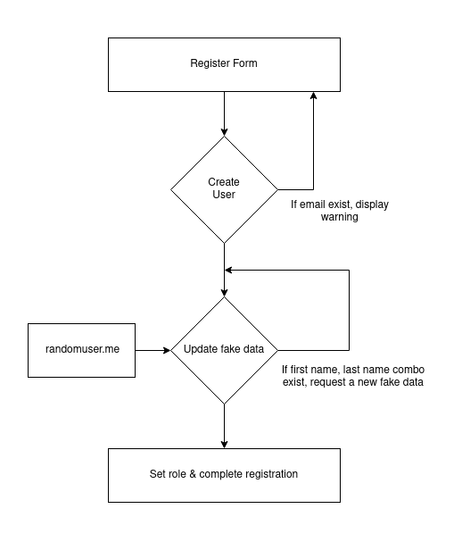
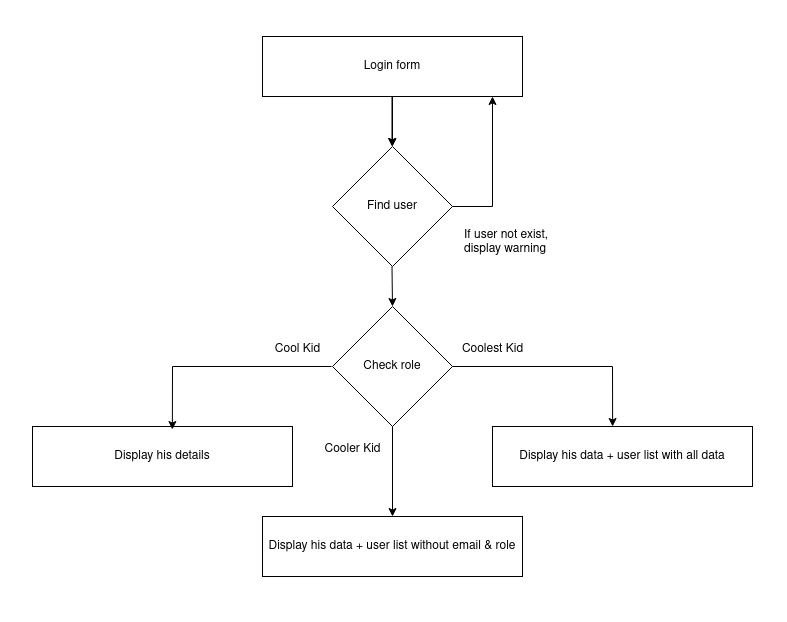

### Requirement

A WordPress site needs user registration & login functionality in a public page. Registered users have a custom user role & they can see customized data based on the user role.

The email is the required data on creating an account. Password is another required field, but has provision to skip password.

When creating an account, use the submitted email as the email address. Set submitted password as password. Request random data from randomuser.me API and set first name, last name & country from the API response.

When saving a fake first name & last name, we need to verify that combination must be unique because later we need to use that combination or email to update user roles through custom REST API endpoint.

Need 3 custom user roles.

1. Cool kid :- When creating a user from the front end registration form, this will be the default user role. He can login & view his details like first name, last name, country, email, address & role.
2. Cooler kid :- He can login & view his details. Additionally, he can view all users' lists with first name, last name & country. He can't view other user's email & roles.
3. Coolest kid :- He can login & view his details. Additionally, he can view all users' lists with all data like first name, last name, country, email address & role.

Need to develop a restricted API endpoint to update user roles by passing email or first name and last name with user role. 3 possible user roles that can be updated are cool kid, cooler kid & coolest kid. To update user roles through REST API, credentials of a user with admin privilege required.

### Technical details

1. Character

Requirement is when an account was created, create a character with first name, last name, country, email address & role properties. So it’s better to use WordPress default user model for the character. In WordPress user model, first name, last name, email & role properties already exist. For additional properties, I can use custom user meta.

2. Register form, Login form & user list
To display all these details, a single short code is enough. We can display details based on query parameters and logged in status.

To display the user list, we can use WP_User_Query.

3. REST API endpoint to update role
For the custom API endpoint, we can extend WP_REST_Controller.

### Flowchart

### Testing API endpoint

	curl -X PUT http://localhost/wordpress/wp-json/cool-kids-network/v1/role \
	    -u "admin:ZLAG gcHk e41I 37R9 Elmo wyxa" \
	    -H "Content-Type: application/json" \
	    -d '{
	        "email": "sarathlal+1@gmail.com",
	        "role": "coolest_kid"
	    }'

	curl -X PUT http://localhost/wordpress/wp-json/cool-kids-network/v1/role \
	    -u "admin:ZLAG gcHk e41I 37R9 Elmo wyxa" \
	    -H "Content-Type: application/json" \
	    -d '{
	        "first_name": "Alexandra",
	        "last_name": "Jean",
	        "role": "cool_kid"
	    }'